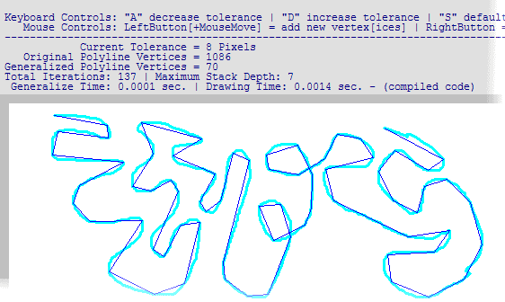



## Douglas\-Peucker Generalization Algorithm for simplifying 2D &amp; 3D polylines and polygons

### Description

The process of generalization is normally executed when the map scale has to be reduced. Another usage is in cleaning up noisy representations of polylines, possibly generated by a raster-to-vector conversion (tracing).

Generalization can be seen as a form of lossy data compression; given a large and complicated object, we seek to simplify it by reducing detail. Ideally, we obtain a polyline/polygon with far fewer vertices that looks essentially the same at a target scale. This can be a big win in computer graphics, where replacing a large model with a smaller one might have little visual impact but require significantly less storage space and rendering time.
 
### More Info
 

             |
---                |---
**Submitted On**   |2006-05-04 06:40:02
**By**             |[ Stavros](https://github.com/Planet-Source-Code/PSCIndex/blob/master/ByAuthor/stavros.md)
**Level**          |Intermediate
**User Rating**    |5.0 (90 globes from 18 users)
**Compatibility**  |VB 6\.0
**Category**       |[Graphics](https://github.com/Planet-Source-Code/PSCIndex/blob/master/ByCategory/graphics__1-46.md)
**World**          |[Visual Basic](https://github.com/Planet-Source-Code/PSCIndex/blob/master/ByWorld/visual-basic.md)
**Archive File**   |[Douglas\-Pe199199542006\.zip](https://github.com/Planet-Source-Code/stavros-douglas-peucker-generalization-algorithm-for-simplifying-2d-amp-3d-polylines-and-p__1-65175/archive/master.zip)

### API Declarations

gdi32, kernel32

